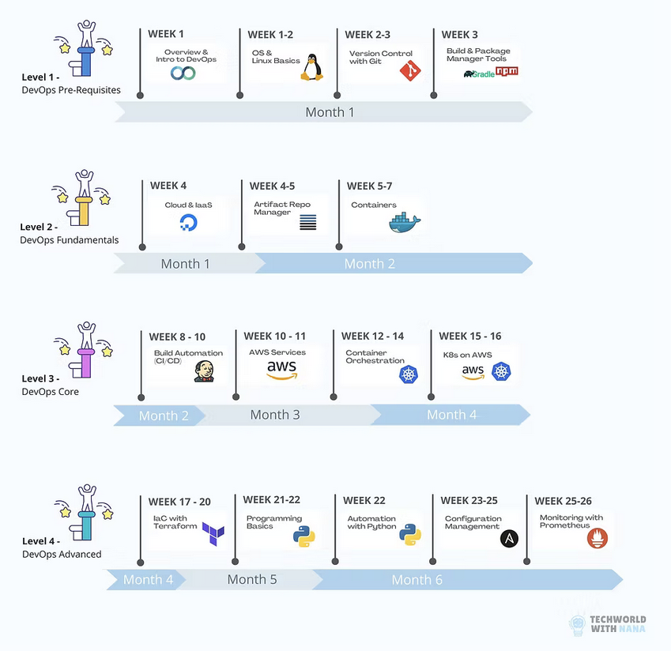

# Techworld with Nana Devops Bootcamp

This is my journey to Devops, using Nanas Techworld & my own projects (inc articles and more expansive areas covering multiple languages (Java, JS & Node.js, Python, C/C++, Go, Rust, Ruby, PHP, .NET, Scala, Kotlin, Dart / Flutter, Elixir and Haskell)). The aim is to be a proficient Devops Engineer / SRE, covering as many languages and tools as possible in order to land a Devops or SRE role

------------------------------------------------------------------
# Demo Projects

All demos can be found [here](demo-projects)
- [Bonus - Databases](notes/databases.md)
- [2 - Operating Systems & Linux Basics](notes/2-OS-linux-basics.md)
- [3 - Version Control with Git](notes/3-VC-with-git.md)
- [4 - Build Tools and Package Manager Tools](notes/4-build-package-manager.md)
- [5 - Cloud & Infrastructure as Service Basics with DigitalOcean](notes/5-cloud-inf-basics-Digi-ocean.md)
- [6 - Artifact Repository Manager with Nexus](notes/6-nexus.md)
- [7 - Containers with Docker](notes/7-docker.md)
- [8 - Build Automation & CI/CD with Jenkins](notes/8-jenkins.md)
- [9 - AWS Services](notes/9-aws.md)
- [10 - Container Orchestration with Kubernetes](notes/10-K8.md)
- [11 - Kubernetes on AWS - EKS](notes/11-k8-aws.md)
- [12 - Infrastructure as Code with Terraform](notes/12-terraform.md)
- [13 - Programming Basics with Python](notes/13-python-basics.md)
- [14 - Automation with Python](notes/14-python-automation.md)
- [15 - Configuration Management with Ansible](notes/15-ansible.md)
- [16 - Monitoring with Prometheus](notes/16-Prometheus.md)

## Setup scripts

- [Setup droplet](digital-ocean/setup-droplet.sh)

# 📘 8-Week DevOps Bootcamp Roadmap (Advanced Track)

This roadmap is designed to guide you through a structured, project-based DevOps learning journey over 8 weeks, based on ~6 hours of daily study. It combines foundational concepts with industry-standard tools like Docker, Kubernetes, Jenkins, AWS, Terraform, and more.

---

## 🗓️ Weekly Breakdown

### ✅ Week 1: Linux, Git, & Build Tools

**Topics:**
- Operating Systems & Linux CLI (permissions, systemd, users)
- Git (branching, merging, remote repos)
- Build Tools (Make, Maven) and Package Managers (apt, pip)

**Project:**  
🔧 *DevOps Shell Toolkit*  
Automate tasks with Bash: log rotation, system updates, Git hooks, and build scripts.

**Blog Prompt:**  
✍️ _“How Linux & Git form the foundation of DevOps: explained like I’m 5”_

---

### ✅ Week 2: Cloud Basics & Nexus

**Topics:**
- DigitalOcean droplets, DNS, SSH
- Nexus Repository Manager setup and use

**Project:**  
☁️ *Private Package Hosting on DigitalOcean*  
Deploy Nexus, host and retrieve Docker or Python artifacts.

**Blog Prompt:**  
✍️ _“How I hosted my own package registry on the cloud (and why it matters in DevOps)”_

---

### ✅ Week 3: Containers with Docker

**Topics:**
- Docker CLI, images, volumes, networks
- Docker Compose
- Pushing images to private Nexus registry

**Project:**  
🐳 *Microservice in a Container*  
Containerize an app, use Compose to run with DB + registry.

**Blog Prompt:**  
✍️ _“Containers in Plain English: Dockerizing My First Real Project”_

---

### ✅ Week 4: Jenkins CI/CD

**Topics:**
- Jenkins setup, jobs, pipelines, GitHub webhooks
- Docker integration and Nexus artifact pushes

**Project:**  
🛠 *CI/CD Pipeline with Jenkins*  
Automated pipeline: test → build → push → deploy.

**Blog Prompt:**  
✍️ _“CI/CD with Jenkins: I Automated My Deployment — Here's What I Learned”_

---

### ✅ Week 5: AWS Core Services + EKS Intro

**Topics:**
- EC2, IAM, VPC, S3
- EKS overview and preparation

**Project:**  
🌐 *AWS App Hosting Starter Pack*  
Deploy app on EC2, use S3 storage, configure IAM roles.

**Blog Prompt:**  
✍️ _“First Steps with AWS for DevOps: Deploying an App with EC2 & S3”_

---

### ✅ Week 6: Kubernetes + EKS

**Topics:**
- Kubernetes objects, Helm, Ingress
- Deploying microservices to EKS

**Project:**  
☸️ *K8s on AWS — From Zero to Service*  
Deploy app to EKS using Helm with Ingress and Secrets.

**Blog Prompt:**  
✍️ _“Taming Kubernetes: How I Deployed a Cloud App with EKS”_

---

### ✅ Week 7: Terraform + Ansible

**Topics:**
- Terraform (providers, modules, remote state)
- Ansible roles, playbooks, vault

**Project:**  
📦 *End-to-End IaC Deployment*  
Provision with Terraform, configure with Ansible, push artifacts.

**Blog Prompt:**  
✍️ _“Provisioning Like a Pro: My First Real-World Terraform + Ansible Workflow”_

---

### ✅ Week 8: Python, Automation & Monitoring

**Topics:**
- Python scripting basics and automation tasks
- Monitoring with Prometheus, Grafana, alerting

**Project:**  
📊 *DevOps Dashboard + Auto-Remediation Bot*  
Monitor a live app and trigger automated responses using Python scripts.

**Blog Prompt:**  
✍️ _“How I Built a DevOps Monitoring Stack That Responds Automatically”_

---

## 🧠 Daily Study Plan (6 Hours per Day)

| Time | Activity | Purpose |
|------|----------|---------|
| **1h** | Review & Reflect | Recap previous day, active recall |
| **2h** | Learn New Concepts | Watch videos, read docs, take notes |
| **1.5h** | Hands-On Practice | Build modules, experiment |
| **1h** | Write a Blog (Feynman) | Simplify and explain what you learned |
| **0.5h** | Flashcards / Review | Repetition via Anki or markdown |

---

## 📂 Recommended Tools

- **Code**: VS Code, GitHub Desktop
- **Cloud**: DigitalOcean, AWS Free Tier
- **Docs & Notes**: Obsidian, Notion, Markdown
- **Blog**: Dev.to, Hashnode, GitHub Pages
- **Monitoring**: Prometheus + Grafana
- **IaC**: Terraform + Ansible
- **CI/CD**: Jenkins, GitHub Actions

---

## ✅ Final Notes

This roadmap is a job-ready DevOps bootcamp you can complete in **2 months** at ~6 hours/day. Each project is designed to be public, portfolio-worthy, and rich in real-world tooling. Start applying for DevOps roles as soon as you can confidently explain your projects.

Good luck — and keep learning out loud! 🚀